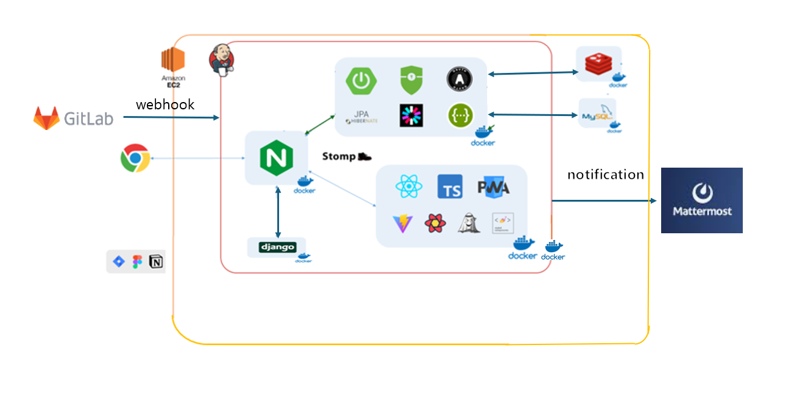

# 🌿 풀러팅 (Fullerting)

<div align="center">
  
  
  **도시농부를 위한 작물 거래 및 커뮤니티 플랫폼**
  
  [](https://reactjs.org/)
  [](https://spring.io/projects/spring-boot)
  [](https://www.typescriptlang.org/)
  [](https://www.docker.com/)
  [](https://jenkins.io/)
</div>

## 📋 목차

- [프로젝트 소개](#-프로젝트-소개)
- [주요 기능](#-주요-기능)
- [기술 스택](#-기술-스택)
- [시스템 아키텍처](#-시스템-아키텍처)
- [설치 및 실행](#-설치-및-실행)
- [API 문서](#-api-문서)
- [팀원 소개](#-팀원-소개)
- [협업 도구](#-협업-도구)

## 🌟 프로젝트 소개

**풀러팅**은 도시농부들이 자신이 기른 작물을 거래하고, 재배 경험을 공유할 수 있는 종합 플랫폼입니다. 

### 핵심 가치
- 🥬 **신선한 작물 거래**: 동네 인증을 통한 신뢰할 수 있는 작물 거래
- 📝 **작물 재배 기록**: AI 기반 작물 인식과 함께하는 스마트 재배 일지
- 👥 **커뮤니티**: 농작물 재배 경험과 꿀팁 공유
- 🏡 **텃밭 정보**: 지역별 텃밭 위치 및 정보 제공

## 🚀 주요 기능

### 📱 메인화면

<div align="center">
  
  
</div>

- 홈, 작물거래, 커뮤니티, 작물일지, 마이페이지 네비게이션
- 실시간 알림 및 채팅 기능
- PWA 지원으로 앱과 같은 사용자 경험

### 🥬 작물거래

#### 동네인증
<div align="center">
  
  
</div>

#### 거래 시스템
<div align="center">
  
  
</div>

#### 제안 시스템
<div align="center">
  
  
</div>

#### 실시간 채팅
<div align="center">
  
  
</div>

**특징:**
- GPS 기반 동네 인증 시스템
- 일반거래 및 제안거래 방식 지원
- WebSocket 기반 실시간 채팅
- 거래 완료 자동 처리

### 📝 작물일지

#### 작물 관리
<div align="center">
  
  
</div>

#### 일기 작성
<div align="center">
  
  
  
</div>

#### AI 작물 인식
<div align="center">
  
  
</div>

**특징:**
- TensorFlow 기반 작물 인식 AI
- 생육 단계별 자동 분류
- 수확 완료 시 뱃지 획득 시스템
- 작물별 맞춤 재배 팁 제공

### 👥 커뮤니티

<div align="center">
  
  
  
</div>

**카테고리:**
- 자유게시판
- 작물소개
- 꿀팁공유
- 텃밭요리

### 🏡 텃밭정보

<div align="center">
  
  
</div>

- 카카오맵 API 기반 텃밭 위치 정보
- 지역별 텃밭 상세 정보 제공

### 👤 마이페이지

<div align="center">
  
  
  
</div>

**기능:**
- 프로필 관리
- 뱃지 컬렉션
- 거래 내역 관리
- 관심 게시글 관리

## 🛠 기술 스택

### Frontend
| 기술 | 버전 | 용도 |
|------|------|------|
| React | 18.2.0 | UI 라이브러리 |
| TypeScript | 5.2.2 | 타입 안정성 |
| Vite | 5.1.6 | 빌드 도구 |
| Styled Components | 6.1.8 | CSS-in-JS |
| Jotai | 2.7.0 | 상태 관리 |
| TanStack Query | 5.28.6 | 서버 상태 관리 |
| React Router DOM | 6.22.3 | 라우팅 |
| React Kakao Maps SDK | 1.1.26 | 지도 서비스 |
| StompJS | 7.0.0 | WebSocket 통신 |

### Backend
| 기술 | 버전 | 용도 |
|------|------|------|
| Spring Boot | 3.2.3 | 웹 프레임워크 |
| Spring Security | - | 인증/인가 |
| Spring Data JPA | - | ORM |
| Spring WebSocket | - | 실시간 통신 |
| Spring Kafka | - | 메시지 큐 |
| JWT | 0.11.5 | 토큰 인증 |
| MySQL | - | 메인 데이터베이스 |
| Redis | - | 캐시/세션 |
| MongoDB | - | 채팅 로그 |
| QueryDSL | 5.0.0 | 동적 쿼리 |

### AI/ML
| 기술 | 버전 | 용도 |
|------|------|------|
| TensorFlow | 2.13.0 | 딥러닝 프레임워크 |
| Keras | 2.13.1 | 고수준 API |
| Django | 4.2.11 | AI 서버 |
| Teachable Machine | - | 모델 학습 |

### DevOps
| 기술 | 용도 |
|------|------|
| Docker | 컨테이너화 |
| Docker Compose | 멀티 컨테이너 관리 |
| Jenkins | CI/CD |
| Nginx | 리버스 프록시 |
| AWS | 클라우드 인프라 |

## 🏗 시스템 아키텍처

<div align="center">
  
</div>

### 아키텍처 특징
- **마이크로서비스**: Frontend, Backend, AI 서버 분리
- **실시간 통신**: WebSocket + Kafka 조합
- **스케일링**: Docker 컨테이너 기반 수평 확장
- **보안**: JWT + OAuth2 인증 시스템
- **모니터링**: Jenkins CI/CD 파이프라인

### 실시간 시스템 설계

#### Kafka + Redis 역할 분리
- **Kafka**: 실시간 메시지 전송 및 알림
  - 입찰 발생 시 즉시 Kafka로 메시지 전송
  - WebSocket을 통해 실시간 화면 업데이트
  - 파티션 키를 사용한 메시지 순서 보장

- **Redis**: 상태 캐시 및 빠른 조회
  - 경매 상태(현재가, 최고입찰자) 캐싱
  - 조회 시 DB 부하 감소
  - 1시간 만료 시간으로 메모리 관리

#### 입찰 현황 조회 동작
- **경매글(작물) 상세 페이지에 진입하면**
  - 판매자(작물 내놓은 사람)와 구매자(입찰자) 모두
  - useQuery로 API를 호출하면 백엔드가 Redis에서 "auction:{경매글ID}"로 상태를 조회
  - Redis에 값이 있으면 현재가, 최고입찰자 등 입찰 현황을 바로 응답
  - 없으면 DB에서 조회
  - 프론트엔드는 이 값을 화면에 렌더링
- 즉, "렌더링하면 바로 보이는 입찰 정보"가 Redis 캐시를 통해 빠르게 제공됨

#### 동작 흐름
```
입찰 발생 시:
1. DB에 입찰 기록 저장
2. Redis에 상태 캐시 저장 (조회용)
3. Kafka로 실시간 메시지 전송 (알림용)

조회 시:
1. Redis에서 상태 우선 조회 (빠른 응답)
2. 없으면 DB에서 조회

실시간 알림 시:
1. Kafka 메시지로 WebSocket 전송
2. 화면 실시간 업데이트
```

#### 기술적 장점
- **성능 최적화**: Redis 캐시로 빠른 조회
- **실시간성**: Kafka + WebSocket으로 즉시 알림
- **확장성**: 각각 독립적으로 스케일링 가능
- **안정성**: 메시지 순서 보장 및 장애 복구

## 💻 설치 및 실행

### 사전 요구사항
- Node.js 18+
- Java 17
- Docker & Docker Compose
- Python 3.8+ (AI 서버용)

### 1. 프로젝트 클론
```bash
git clone https://github.com/your-repo/fullerting.git
cd fullerting
```

### 2. Frontend 실행
```bash
cd frontend
npm install
npm run dev
```

### 3. Backend 실행
```bash
cd backend
./gradlew bootRun
```

### 4. AI 서버 실행
```bash
cd A.I
pip install -r requirements.txt
python manage.py runserver
```

### 5. Docker Compose 실행 (전체 서비스)
```bash
cd backend
docker-compose up -d
```

### 환경 변수 설정
프로젝트 루트에 `.env` 파일을 생성하고 다음 변수들을 설정하세요:

```env
# Database
DB_HOST=localhost
DB_PORT=3306
DB_NAME=fullerting
DB_USERNAME=root
DB_PASSWORD=password

# JWT
JWT_SECRET=your-jwt-secret
JWT_EXPIRATION=86400000

# Kakao OAuth
KAKAO_CLIENT_ID=your-kakao-client-id
KAKAO_CLIENT_SECRET=your-kakao-client-secret

# AWS S3
AWS_ACCESS_KEY=your-aws-access-key
AWS_SECRET_KEY=your-aws-secret-key
AWS_S3_BUCKET=your-s3-bucket

# Firebase FCM
FIREBASE_PROJECT_ID=your-firebase-project-id
```

## 📚 API 문서

### Swagger UI
- **개발 환경**: http://localhost:8080/swagger-ui.html
- **프로덕션**: https://api.fullerting.com/swagger-ui.html

### 주요 API 엔드포인트

#### 인증
```
POST /api/auth/login          # 로그인
POST /api/auth/refresh        # 토큰 갱신
GET  /api/auth/profile        # 프로필 조회
```

#### 작물 거래
```
GET    /api/trade/posts       # 거래 게시글 목록
POST   /api/trade/posts       # 거래 게시글 생성
GET    /api/trade/posts/{id}  # 거래 게시글 상세
POST   /api/trade/proposals   # 거래 제안
```

#### 작물 일지
```
GET    /api/diary/crops       # 작물 목록
POST   /api/diary/crops       # 작물 생성
PUT    /api/diary/crops/{id}  # 작물 수정
POST   /api/diary/recognize   # AI 작물 인식
```

#### 커뮤니티
```
GET    /api/community/posts   # 게시글 목록
POST   /api/community/posts   # 게시글 작성
GET    /api/community/posts/{id} # 게시글 상세
POST   /api/community/comments # 댓글 작성
```

## 👥 팀원 소개

| 이름 | 역할 | 담당 영역 | 기술 스택 |
|------|------|-----------|-----------|
| **김진명** (팀장) | Backend | 회원, 마이페이지, 알림 | Spring Boot, Spring Security, JWT |
| **문혜린** | Backend | 작물일지, 텃밭정보, 채팅 | Spring WebSocket, Kafka, MongoDB |
| **정준원** | Backend, DevOps | 작물거래, 커뮤니티, CI/CD | Spring Boot, Docker, Jenkins |
| **김나연** | Frontend | 회원, 작물일지, 텃밭정보 | React, TypeScript, Kakao Maps |
| **심우석** | Frontend | 메인페이지, 마이페이지, 커뮤니티 | React, Styled Components, Jotai |
| **오정민** | Frontend | 작물거래, 채팅 | React, WebSocket, TanStack Query |

## 🛠 협업 도구

### 개발 도구
- **버전 관리**: GitLab
- **이슈 관리**: Jira
- **문서 관리**: Notion
- **API 테스트**: Postman

### 문서 링크
- [📋 화면구성도](https://www.figma.com/file/Sknk6qQVE8fAiR5nOFvxza/%ED%92%80%EB%9F%AC%ED%8C%85?type=design&node-id=127-5825&mode=design&t=MnKBPQRoEeXjfoAR-0)
- [📄 페이지 명세서](https://www.notion.so/e6dd58e2958e4d87a058ba5411bdc34b?v=490bc367fa934dd6b4d8f99816e66ba6)
- [🧩 컴포넌트 명세서](https://www.notion.so/a1d316ad22c14e8d8615d9fd25b97608?v=a9f05331c88348239700d19d218dfb57)
- [🗄️ ERD](https://www.notion.so/ERD-dc7ce2874a2b4e0c8078cb161eadd6d6)
- [🔌 API 명세서](https://www.notion.so/44419a63e21b4465b541f5cb0ce26b57?v=9deef6569fdd47b98a22de3c9d91ca21)

## 📄 라이선스

이 프로젝트는 MIT 라이선스 하에 배포됩니다. 자세한 내용은 [LICENSE](LICENSE) 파일을 참조하세요.

## 🤝 기여하기

1. Fork the Project
2. Create your Feature Branch (`git checkout -b feature/AmazingFeature`)
3. Commit your Changes (`git commit -m 'Add some AmazingFeature'`)
4. Push to the Branch (`git push origin feature/AmazingFeature`)
5. Open a Pull Request

---

<div align="center">
  <p>🌱 <strong>풀러팅</strong>과 함께 도시농부의 새로운 경험을 시작하세요! 🌱</p>
  
  <p>문의사항: <a href="mailto:contact@fullerting.com">contact@fullerting.com</a></p>
</div>
